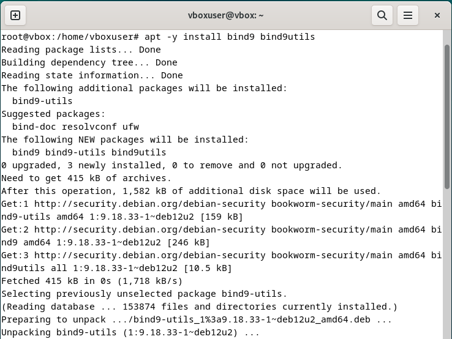

# Tugas DNS

**Nama dosen pengampu:**

Dr Ferry Astika Saputra ST, M.Sc

**Dikerjakan oleh**
Nama 		: Nayla Herfiana Putri
NRP 		: 3123600015
Kelas 		: 2 D4 IT A

# Konfigurasi DNS untuk Jaringan Internal

## 1. Instalasi BIND

Mengisntall BIND dengan perintah `sudo apt -y install bind9 bind9utils`

## 2. Konfigurasi BIND

Pada file /etc/bind/named.conf tambahkan `include "/etc/bind/named.conf.internal-zones";`

Kemudian pada file `/etc/bind/named.conf.options` tambahkan teks sebagai berikut

Lalu atur konfigurasi pada file `/etc/bind/named.conf.internal-zones` menjadi:

## 3. Konfigurasi File Zona untuk Jaringan Internal

Pada file `/etc/bind/nay.home.lan` tambahkan teks:

Kemudian pada file `/etc/bind/0.0.10.db`

## 4. Restart BIND Service

Menggunakan perintah `sudo systemctl restart bind9`

## 5. Testing

Menggunakan perintah `dig www.xxx.home 10.0.0.1`

# Konfigurasi DNS untuk Jaringan External

## 1. Instalasi BIND

Mengisntall BIND dengan perintah `sudo apt -y install bind9 bind9utils`

## 2. Konfigurasi BIND

Pada file /etc/bind/named.conf tambahkan `include "/etc/bind/named.conf.external-zones";`

Kemudian pada file `/etc/bind/named.conf.options` tambahkan teks sebagai berikut

Lalu atur konfigurasi pada file `/etc/bind/named.conf.external-zones` menjadi:

## 3. Konfigurasi File Zona untuk Jaringan Internal

Pada file `/etc/bind/nay.home.lan` tambahkan teks:

Kemudian pada file `/etc/bind/0.0.10.db`

## 4. Restart BIND Service

Menggunakan perintah `sudo systemctl restart bind9`

## 5. Testing

Menggunakan perintah `dig www.xxx.home 10.0.0.1`

